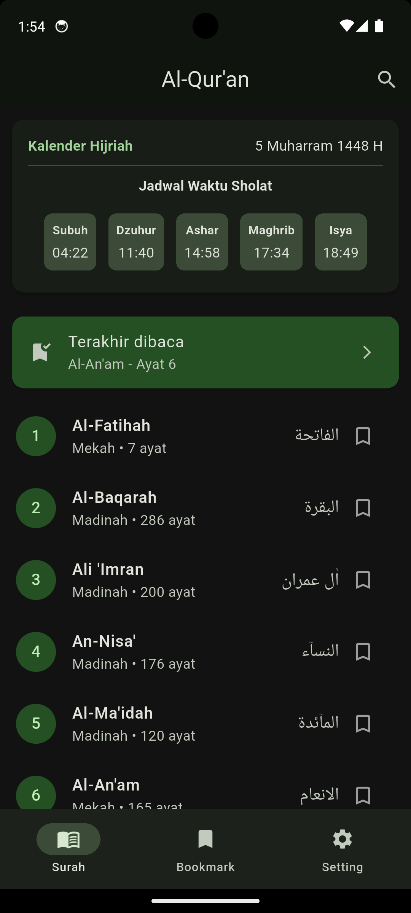
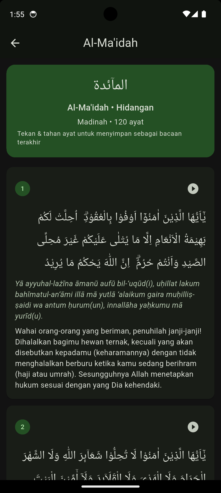
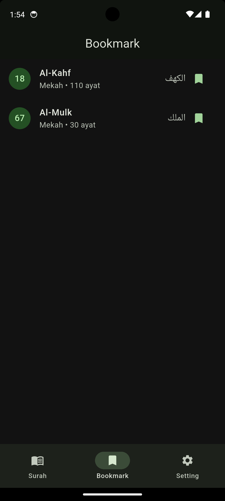
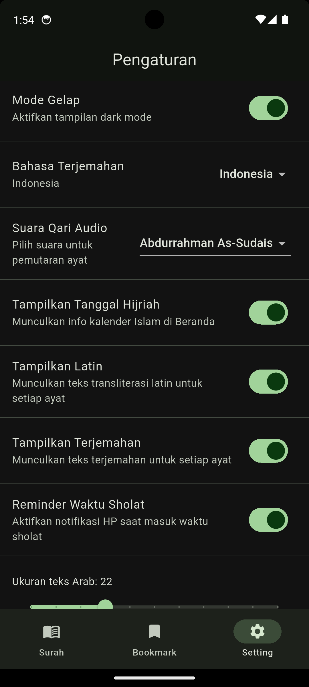

<p align="center">
  
</p>

<h1 align="center">📖 Al-Qur'an App</h1>

<p align="center">
  Aplikasi Al-Qur'an modern berbasis Flutter yang dirancang dengan antarmuka yang indah, responsif, dan kaya akan fitur guna mempermudah interaksi pengguna dalam membaca, mempelajari, dan mendengarkan Al-Qur'an sehari-hari.
</p>

---

## 🔌 Sumber Data & Referensi Teknis

Untuk membantu peninjauan oleh tim rekrutmen (*recruiter*), berikut adalah rincian mengenai sumber data, API, serta referensi teknis yang digunakan dalam pengembangan aplikasi ini:

### 1. Sumber Data & API Konten
*   **Daftar & Isi Ayat Al-Qur'an**: Menggunakan API Publik dari [equran.id v2](https://equran.id/api/v2) untuk memuat daftar 114 surah, transliterasi Latin, terjemahan bahasa Indonesia, serta tautan audio Murottal (dengan pilihan beberapa Qari ternama).
*   **Terjemahan Bahasa Inggris**: Menggunakan [Al-Qur'an Cloud API](https://api.alquran.cloud) (`https://api.alquran.cloud/v1/surah/$nomor/en.sahih`) untuk menyinkronkan teks terjemahan bahasa Inggris secara dinamis di setiap ayat.
*   **Pengingat Waktu Sholat**: Waktu sholat dipersiapkan menggunakan data statis/lokal terjadwal di beranda, yang siap diintegrasikan lebih lanjut dengan [AlAdhan API](https://api.aladhan.com) untuk sinkronisasi waktu sholat otomatis berbasis koordinat GPS/Kota.

### 2. Referensi Implementasi & Arsitektur
*   **Pola Arsitektur (Clean Architecture)**: Pemisahan folder proyek (`core`, `data`, dan `presentation`) dirancang untuk menjaga kerapihan kode (*separation of concerns*). Ini memudahkan pengujian unit (*unit testing*) dan pengembangan fitur baru secara mandiri tanpa merusak modul yang sudah ada.
*   **Manajemen State (Riverpod)**: Menggunakan `StateNotifierProvider` untuk memisahkan logika bisnis (seperti pemutaran audio, bookmark, pencarian, dan pengaturan preferensi) dari komponen UI (screens dan widgets).
*   **Penyimpanan Lokal (Cache & Settings)**:
    *   Pengaturan preferensi (ukuran font, bahasa terjemahan, toggle Latin) dan markah/terakhir dibaca disimpan secara persisten menggunakan `shared_preferences`.
    *   Daftar surah di-cache selama 12 jam agar aplikasi tetap responsif dan dapat diakses ketika pengguna dalam kondisi offline (tidak memiliki koneksi internet).
*   **Sistem Notifikasi Lokal**: Logika notifikasi adzan diimplementasikan menggunakan `flutter_local_notifications` dengan penentuan zona waktu menggunakan package `timezone` untuk memastikan notifikasi dikirimkan pada jam yang akurat dan terjadwal harian.

---

## 📸 Tampilan Aplikasi

Berikut adalah tampilan beberapa halaman utama dalam aplikasi:

| Halaman Beranda | Detail Surah | Bookmark & Terakhir Dibaca | Pengaturan Aplikasi |
| :---: | :---: | :---: | :---: |
|  |  |  |  |

---

## ✨ Fitur Utama

Aplikasi Al-Qur'an ini dilengkapi dengan berbagai fitur unggulan:

*   **📖 Baca Al-Qur'an Lengkap**: Akses 114 Surah lengkap dengan teks Arab asli, transliterasi Latin, serta Terjemahan dinamis.
*   **🎧 Pemutaran Audio Qari**: Dengarkan lantunan ayat suci per ayat dengan pilihan Qari ternama:
    *   Mishary Rashid Al-Alafasy
    *   Saad Al-Ghamidi
    *   Abdurrahman As-Sudais
*   **🔔 Pengingat Waktu Sholat (Adzan)**: Notifikasi terjadwal otomatis di ponsel saat masuk waktu sholat (Subuh, Dzuhur, Ashar, Maghrib, Isya).
*   **📅 Kalender Hijriah**: Menampilkan informasi penanggalan Hijriah di halaman utama secara real-time.
*   **🔍 Pencarian Cepat**: Cari surah pilihan dengan mudah berdasarkan nama latin atau nama Indonesia secara instan.
*   **🔖 Markah & Terakhir Dibaca**: Simpan surah favorit dan tandai ayat terakhir dibaca untuk melanjutkan tadarus dengan mudah langsung dari beranda.
*   **⚙️ Pengaturan Kustomisasi Penuh**:
    *   **Mode Gelap (Dark Mode)**: Mengubah tema visual aplikasi sesuai dengan kenyamanan mata pengguna.
    *   **Ukuran Font Arab**: Slider dinamis untuk menyesuaikan ukuran teks Arab.
    *   **Pilihan Bahasa Terjemahan**: Beralih antara Terjemahan bahasa Indonesia dan bahasa Inggris.
    *   **Tampilkan Latin & Terjemahan**: Aktifkan atau sembunyikan transliterasi latin dan teks terjemahan sesuai kebutuhan membaca.

---

## 🛠️ Tech Stack & Dependensi

Proyek ini dibangun menggunakan teknologi terbaru di ekosistem Flutter:

*   **Core**: [Flutter SDK](https://flutter.dev) (Dart SDK `>=3.13.0-167.0.dev`)
*   **State Management**: [Flutter Riverpod](https://pub.dev/packages/flutter_riverpod) untuk arsitektur state yang reaktif dan bersih.
*   **Local Persistence**: [Shared Preferences](https://pub.dev/packages/shared_preferences) untuk menyimpan bookmark, ayat terakhir dibaca, dan konfigurasi pengaturan pengguna.
*   **Local Notifications**: [Flutter Local Notifications](https://pub.dev/packages/flutter_local_notifications) untuk manajemen pengingat waktu sholat yang tepat waktu.
*   **Audio Player**: [Just Audio](https://pub.dev/packages/just_audio) untuk pemutaran audio ayat yang lancar.
*   **Timezone**: [Timezone](https://pub.dev/packages/timezone) untuk sinkronisasi waktu penjadwalan notifikasi sholat yang akurat.

---

## 📁 Struktur Direktori Proyek

Aplikasi ini menggunakan pola arsitektur bersih (*Clean Architecture*) yang dipisahkan berdasarkan lapisan fungsionalnya:

```text
lib/
├── core/
│   ├── constants/       # Konstanta global dan key SharedPreferences
│   ├── theme/           # Konfigurasi Tema Terang (Light) dan Gelap (Dark)
│   ├── services/        # Service eksternal (Inisialisasi Notifikasi lokal)
│   └── utils/           # Helper dan utilitas tambahan
├── data/
│   ├── models/          # Model data (Surah, Ayat, LastRead)
│   └── repositories/    # Logika fetch API dan penanganan data
└── presentation/
    ├── providers/       # State notifier & Riverpod providers (Audio, Settings, Bookmark, Surah)
    ├── screens/         # Tampilan halaman utama (Home, Detail, Search, Bookmark, Settings, Splash)
    └── widgets/         # Komponen UI modular (AyatCard, SurahListItem, Loading & Error)
```

---

## 🚀 Panduan Memulai (Setup & Instalasi)

Ikuti langkah-langkah di bawah ini untuk menjalankan aplikasi di lingkungan lokal Anda:

### 1. Prasyarat
Pastikan Anda telah menginstal:
*   [Flutter SDK](https://docs.flutter.dev/get-started/install) (versi terbaru direkomendasikan)
*   Android Studio / Xcode
*   Koneksi internet untuk mengunduh package dan data API

### 2. Kloning Repositori
```bash
git clone <url-repositori>
cd flutter_quran_app
```

### 3. Dapatkan Dependensi
Unduh semua dependensi pub yang digunakan dalam proyek:
```bash
flutter pub get
```

### 4. Buat Launcher Icon
Jika Anda melakukan perubahan pada logo atau ingin merestore launcher icon secara native untuk Android, jalankan generator launcher icons:
```bash
flutter pub run flutter_launcher_icons
```

### 5. Jalankan Aplikasi
Jalankan aplikasi pada emulator atau perangkat fisik Anda:
```bash
flutter run
```

---

## 📋 Catatan Rilis Perubahan Terbaru

1.  **Ikon & Logo Baru**: Logo aplikasi diseluruh platform Android serta logo pada halaman Splash Screen telah diperbarui dengan ilustrasi Al-Qur'an bernuansa hijau yang modern dan elegan.
2.  **Perbaikan Notifikasi Sholat**: Menginisialisasi `NotificationService` sejak awal saat aplikasi dibuka dan meminta izin notifikasi untuk perangkat Android 13+.
3.  **Toggles Preferensi Tampilan**: Menambahkan setelan saklar baru di menu pengaturan untuk menyembunyikan atau menampilkan teks Latin serta terjemahan secara fleksibel.
